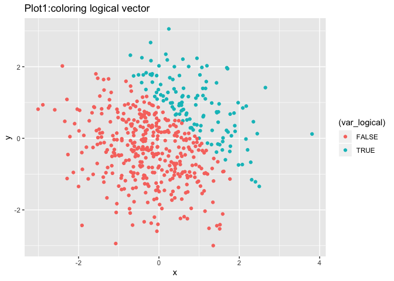
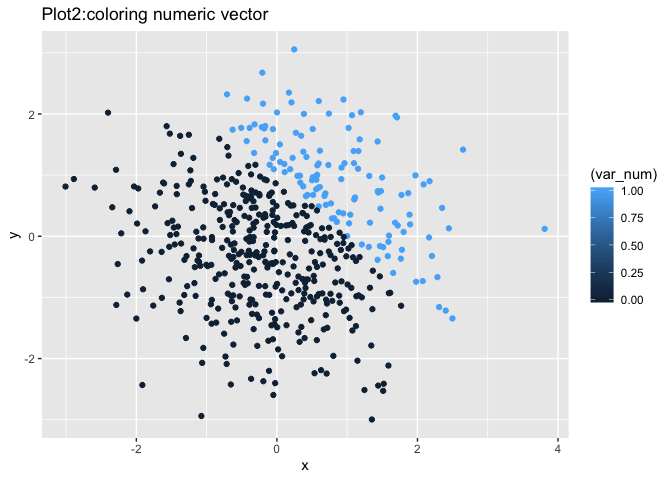
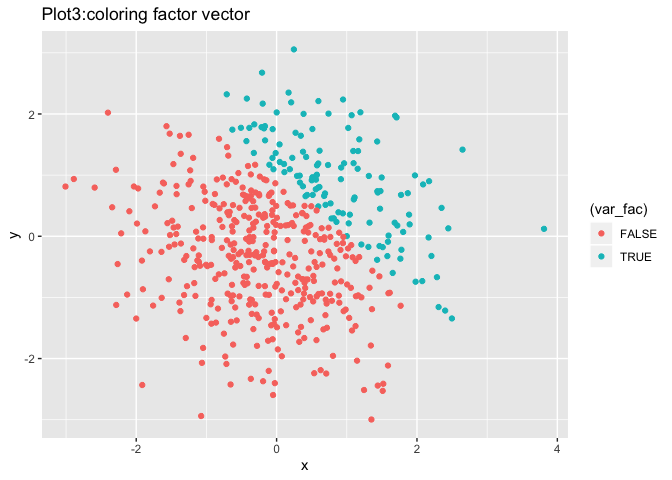

p8105\_hw1\_ra2965
================

Problem 1
=========

Create a data frame and try to get the mean of each variable in it
------------------------------------------------------------------

``` r
library(tidyverse)
```

    ## ── Attaching packages ──────────────────────────────────────────────── tidyverse 1.2.1 ──

    ## ✔ ggplot2 3.2.1     ✔ purrr   0.3.2
    ## ✔ tibble  2.1.3     ✔ dplyr   0.8.3
    ## ✔ tidyr   1.0.0     ✔ stringr 1.4.0
    ## ✔ readr   1.3.1     ✔ forcats 0.4.0

    ## ── Conflicts ─────────────────────────────────────────────────── tidyverse_conflicts() ──
    ## ✖ dplyr::filter() masks stats::filter()
    ## ✖ dplyr::lag()    masks stats::lag()

``` r
hw1_df = tibble(
  vec_numeric = rnorm(8),
  vec_logical = vec_numeric > 0,
  vec_char = c("a",'b','c','d','e','f','g','h'),
  vec_factor = factor(c("low", "medium", "high", "low","medium","high","low","medium"))
)
  
mean(pull(hw1_df, vec_numeric))
```

    ## [1] 0.1569842

``` r
mean(pull(hw1_df, vec_logical))
```

    ## [1] 0.75

``` r
mean(pull(hw1_df, vec_char))
```

    ## Warning in mean.default(pull(hw1_df, vec_char)): argument is not numeric or
    ## logical: returning NA

    ## [1] NA

``` r
mean(pull(hw1_df, vec_factor))
```

    ## Warning in mean.default(pull(hw1_df, vec_factor)): argument is not numeric
    ## or logical: returning NA

    ## [1] NA

I tried to take the mean of each variable in my dataframe. Numeric vector and logical vector works, while character vector and factor vector don't.

Since the vector types of the variable "vec\_char"" and "vec\_factor"" are not numeric or logical, there is a warning and it returns NA.

Try to convert the vectors' type:
---------------------------------

``` r
convert_log_num = as.numeric(pull(hw1_df, vec_logical))
product_num_random = convert_log_num*pull(hw1_df, vec_numeric)

convert_log_fac = as.factor(pull(hw1_df, vec_logical))
product_fac_random = convert_log_fac*pull(hw1_df, vec_numeric)
```

    ## Warning in Ops.factor(convert_log_fac, pull(hw1_df, vec_numeric)): '*' not
    ## meaningful for factors

``` r
convert_fac_num = as.numeric(convert_log_fac)
produc_num_num = convert_fac_num*pull(hw1_df, vec_numeric)
```

‘\*’ is not meaningful for factors so I cannot get the product of factor vector and the random sample.

Problem 2
=========

Create a new data frame:
------------------------

``` r
set.seed(1)
plot_df = tibble(
  x = rnorm(500),
  y = rnorm(500),
  var_logical = c(x + y > 1),
  var_num = as.numeric(var_logical),
  var_fac = as.factor(var_logical))
```

In this data frame, there are 500 rows and 5 colums.

The mean of x is 0.0226441, the median of x is -0.0367783 and the standard deviation of x is 1.0119283.

The proportion of cases for which x + y &gt; 1 is 0.252.

Scatterplots of y vs x:

``` r
ggplot(plot_df, aes(x = x, y = y, color = (var_logical))) + geom_point()
```



``` r
ggsave("plot_logical.pdf")
```

    ## Saving 7 x 5 in image

``` r
ggplot(plot_df, aes(x = x, y = y, color = (var_num))) + geom_point()
```



``` r
ggplot(plot_df, aes(x = x, y = y, color = (var_fac))) + geom_point()
```


