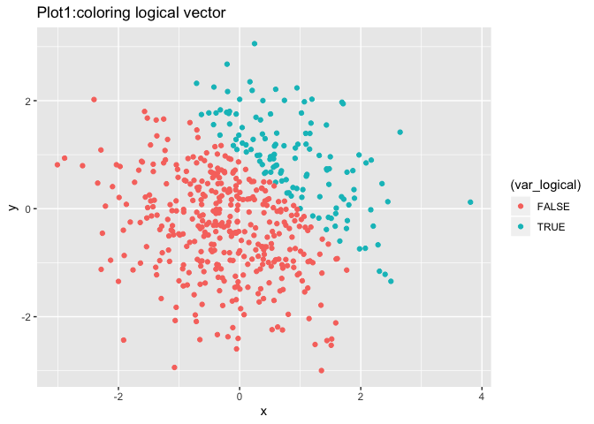
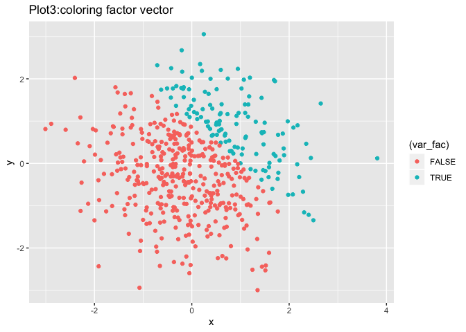

p8105\_hw1\_ra2965
================

Problem 1
=========

Create a data frame and try to get the means
--------------------------------------------

Create a data frame comprised of 5 vectors in 5 different data types, and try to take the means of each vector in this data frame:

``` r
library(tidyverse)
```

    ## ── Attaching packages ──────────────────────────────────────────────── tidyverse 1.2.1 ──

    ## ✔ ggplot2 3.2.1     ✔ purrr   0.3.2
    ## ✔ tibble  2.1.3     ✔ dplyr   0.8.3
    ## ✔ tidyr   1.0.0     ✔ stringr 1.4.0
    ## ✔ readr   1.3.1     ✔ forcats 0.4.0

    ## ── Conflicts ─────────────────────────────────────────────────── tidyverse_conflicts() ──
    ## ✖ dplyr::filter() masks stats::filter()
    ## ✖ dplyr::lag()    masks stats::lag()

``` r
hw1_df = tibble(
  vec_numeric = rnorm(8),
  vec_logical = vec_numeric > 0,
  vec_char = c('a','b','c','d','e','f','g','h'),
  vec_factor = factor(c("low", "medium", "high", "low","medium","high","low","medium"))
)

mean(pull(hw1_df, vec_numeric))
```

    ## [1] 0.2398549

``` r
mean(pull(hw1_df, vec_logical))
```

    ## [1] 0.75

``` r
mean(pull(hw1_df, vec_char))
```

    ## Warning in mean.default(pull(hw1_df, vec_char)): argument is not numeric or
    ## logical: returning NA

    ## [1] NA

``` r
mean(pull(hw1_df, vec_factor))
```

    ## Warning in mean.default(pull(hw1_df, vec_factor)): argument is not numeric
    ## or logical: returning NA

    ## [1] NA

I tried to take the mean of each variable in my dataframe. Numeric vector and logical vector works, while character vector and factor vector don't work.

Then I apply the as.numeric function to the logical, character, factor vectors.

``` r
coerc_logical = as.numeric(pull(hw1_df,vec_logical)) 
coerc_char = as.numeric(pull(hw1_df,vec_char))
coerc_factor = as.numeric(pull(hw1_df,vec_factor))
```

I applied the "as.numeric"" function to the logical, character, and factor variables, and the logical and factor vector was converted to numeric successfully, but the characer vector returns NAs introduced by coercion.

The charactor vector cannot be convert to numeric, and we cannot get the mean of it. The factor vector can be convert to numeric, but if we want to get the mean, we need to convert it to numeric first.

Try to convert vectors' type and multiply with the random sample:
-----------------------------------------------------------------

``` r
convert_log_num = as.numeric(pull(hw1_df, vec_logical))
product_num_random = convert_log_num*pull(hw1_df, vec_numeric)

convert_log_fac = as.factor(pull(hw1_df, vec_logical))
product_fac_random = convert_log_fac*pull(hw1_df, vec_numeric)
```

    ## Warning in Ops.factor(convert_log_fac, pull(hw1_df, vec_numeric)): '*' not
    ## meaningful for factors

``` r
convert_fac_num = as.numeric(convert_log_fac)
produc_num_random = convert_fac_num*pull(hw1_df, vec_numeric)
```

‘\*’ is not meaningful for factors so I cannot get the product of factor vector and the random sample.

Problem 2
=========

Create a new data frame:
------------------------

``` r
set.seed(1)
plot_df = tibble(
  x = rnorm(500),
  y = rnorm(500),
  var_logical = c(x + y > 1),
  var_num = as.numeric(var_logical),
  var_fac = as.factor(var_logical))
```

In this data frame, there are 500 rows and 5 colums.

The mean of x is 0.0226441, the median of x is -0.0367783 and the standard deviation of x is 1.0119283.

The proportion of cases for which x + y &gt; 1 is 0.252.

Scatterplots of y vs x:
-----------------------

In the three plots, colored points used three different types of variable: logical, numeric, factor

``` r
plot_logical = ggplot(plot_df, aes(x = x, y = y, color = (var_logical))) + geom_point()
ggsave("plot_logical.pdf")
```

    ## Saving 7 x 5 in image

``` r
print(plot_logical + ggtitle("Plot1:coloring logical vector"))
```



``` r
plot_num = ggplot(plot_df, aes(x = x, y = y, color = (var_num))) + geom_point()
print(plot_num + ggtitle("Plot2:coloring numeric vector"))
```


``` r
plot_factor = ggplot(plot_df, aes(x = x, y = y, color = (var_fac))) + geom_point()
print(plot_factor + ggtitle("Plot3:coloring factor vector"))
```

 The scatterplot coloring points using the logical vector: the FALSE points are colored as red, and the TRUE points are colored as green.

The scatterplot coloring points using the numeric vector: the color scale is from dark blue to light blue corresponding to 0.00-1.00.

The scatterplot coloring points using the factor vector: the FALSE points are colored as red, and the TRUE points are colored as green.

The factor and logical vectors are not continious, so the color scale is binary. The numeric vector is continuous so the color scale is a continuously changing range.
